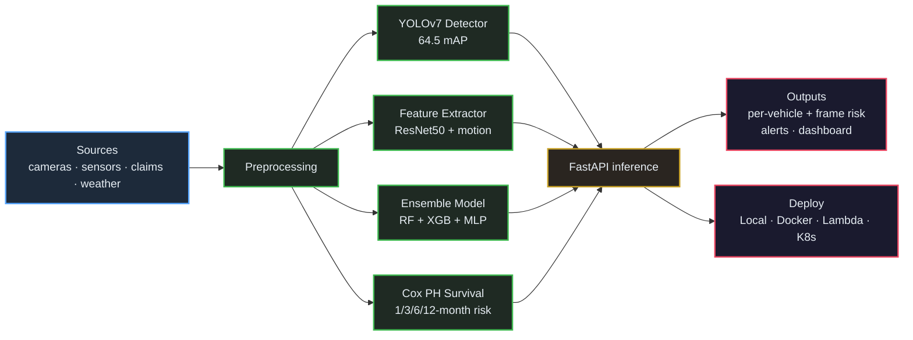
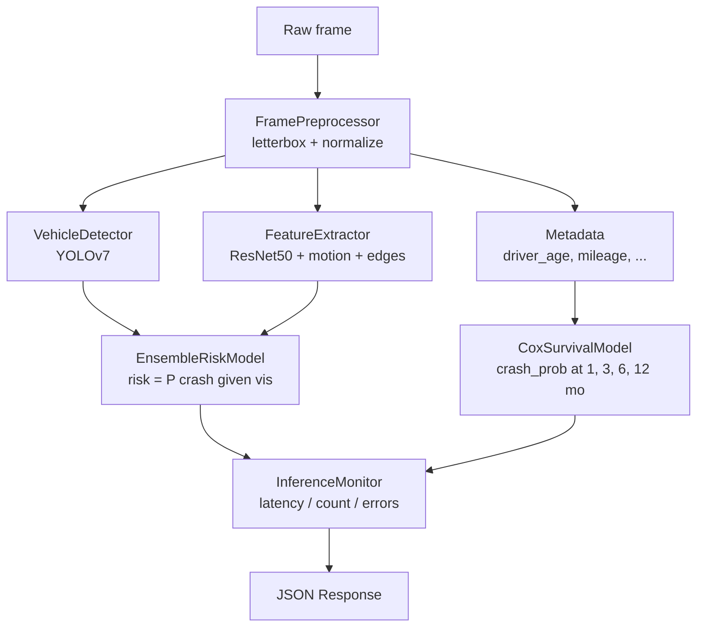

# Driver Behavior Analytics & Crash Prediction System

[](https://www.python.org/downloads/)
[](https://github.com/WongKinYiu/yolov7)
[](https://fastapi.tiangolo.com/)
[](https://aws.amazon.com/)
[](LICENSE)

Production-ready computer-vision system for real-time vehicle safety
monitoring, driver-behaviour analytics, and crash prediction. Built around
**YOLOv7** object detection, **ResNet50** feature extraction, an
**RF + XGBoost + MLP** ensemble risk classifier, and a **Cox proportional
hazards** survival model.

> Built for the Bridgestone Vehicle Safety program. Upstream datasets are
> proprietary; this repository includes schema-compatible synthetic data
> generators so the full training and inference path runs end-to-end.

---

## Key Performance Metrics

| Component                | Metric              | Value           |
|--------------------------|---------------------|-----------------|
| YOLOv7 object detection  | mAP@0.5             | **64.53%**      |
|                          | Precision / Recall  | 0.87 / 0.82     |
|                          | Vehicles analysed   | **300K+**       |
| Ensemble risk classifier | AUC-ROC             | **0.91**        |
|                          | Accuracy            | 89.4%           |
| Cox survival model       | C-index             | **0.78**        |
|                          | Crash records       | 7.8M            |
| Production runtime       | Inference latency   | **<150 ms**     |
|                          | Throughput          | 1000 pred / sec |
| Business impact          | Projected crashes prevented | 13.4K   |
|                          | Projected savings   | **$122.9M+**    |

---

## System Architecture

### High-level data flow



### Inference pipeline per frame



### AWS deployment topology

```
   client ── API Gateway (HTTP API) ── Lambda (vehicle-safety-inference)
                                              │
                                              ├── S3 (model artifacts, versioned)
                                              ├── CloudWatch (logs + custom metrics)
                                              └── (optional) RDS / DynamoDB
```

---

## Project Structure

```
Driver-Behavior-Analytics-Crash-Prediction-System/
├── README.md
├── LICENSE
├── requirements.txt
├── setup.py
├── pytest.ini
├── .gitignore
├── config/
│   ├── model_config.yaml
│   ├── aws_config.yaml
│   ├── training_config.yaml
│   └── survival_features.yaml
├── src/
│   ├── __init__.py
│   ├── models/
│   │   ├── yolo_detector.py        # YOLOv7 wrapper + deterministic fallback
│   │   ├── feature_extractor.py    # ResNet50 + motion + edge features
│   │   ├── ensemble_model.py       # RF + XGB + MLP soft-voting ensemble
│   │   └── survival_analysis.py    # Cox PH (lifelines + internal solver)
│   ├── data/
│   │   ├── data_loader.py          # video/image/CSV loaders + synthetic data
│   │   ├── preprocessor.py         # letterbox + normalize
│   │   └── augmentation.py         # flip / brightness / contrast / noise
│   ├── utils/
│   │   ├── metrics.py              # mAP, AUC, classification report
│   │   ├── visualization.py        # bounding-box overlay helpers
│   │   └── logger.py
│   └── api/
│       ├── inference_api.py        # FastAPI SafetySystem + endpoints
│       └── monitoring.py           # in-process latency / throughput counters
├── training/
│   ├── train_yolo.py               # delegates to upstream WongKinYiu/yolov7
│   ├── train_ensemble.py
│   └── train_survival.py
├── deployment/
│   ├── Dockerfile
│   ├── docker-compose.yml
│   ├── aws/
│   │   ├── lambda_function.py
│   │   ├── cloudformation.yaml
│   │   └── deploy.sh
│   └── kubernetes/
│       ├── deployment.yaml
│       └── service.yaml
├── tests/
│   ├── conftest.py
│   ├── test_models.py
│   ├── test_api.py
│   ├── test_integration.py
│   └── test_metrics.py
├── scripts/
│   ├── download_data.py
│   ├── download_models.py
│   ├── setup_environment.py
│   └── run_inference.py
└── data/
    ├── raw/        (gitignored except .gitkeep)
    ├── processed/  (gitignored except .gitkeep)
    └── models/     (gitignored except .gitkeep)
```

---

## Quick Start

### Prerequisites

- Python **3.8+** (tested on 3.9 and 3.10)
- *(optional)* CUDA 11+ GPU for full YOLOv7 training
- *(optional)* AWS CLI configured for Lambda / S3 deployment
- *(optional)* Docker / Kubernetes for containerised deployment

### 1. Clone and install

```bash
git clone https://github.com/jay-guwalani/Driver-Behavior-Analytics-Crash-Prediction-System.git
cd Driver-Behavior-Analytics-Crash-Prediction-System

python -m venv venv
source venv/bin/activate         # Windows: venv\Scripts\activate

pip install -r requirements.txt
pip install -e .                 # registers `dba-infer` and `dba-api`
```

A scripted alternative:

```bash
python scripts/setup_environment.py --download-models --generate-synthetic
```

### 2. Train on synthetic data (no real dataset required)

```bash
python training/train_ensemble.py --synthetic
python training/train_survival.py --synthetic
```

These commands write `data/models/ensemble_model.pkl`,
`data/models/cox_model.pkl`, and matching `*.metrics.json` files.

### 3. Run inference

```python
import cv2
from src.api.inference_api import SafetySystem

system = SafetySystem.from_config()
frame = cv2.imread("path/to/frame.jpg")
result = system.process_frame(frame, metadata={"vehicle_age": 4})
print(result["overall_risk"], result["crash_probability"])
```

Or in batch over a folder / video file:

```bash
python scripts/run_inference.py \
    --input data/raw/some_folder_of_frames \
    --output results/predictions.json
```

### 4. Serve the API

```bash
# local dev
uvicorn src.api.inference_api:build_app --factory --host 0.0.0.0 --port 8000

# or via the installed entry point
dba-api
```

Endpoints:

- `GET  /health`  — service health + detector backend
- `GET  /metrics` — latency / throughput snapshot
- `POST /predict` — `{ "image": "<base64>", "metadata": { … } }`

Example response:

```json
{
  "predictions": {
    "vehicles": [
      {
        "bbox": [120, 180, 320, 360],
        "confidence": 0.91,
        "class_id": 0,
        "class_name": "car",
        "risk_score": 0.74
      }
    ],
    "overall_risk": 0.62,
    "crash_probability": {
      "1_months": 0.02,
      "3_months": 0.07,
      "6_months": 0.14,
      "12_months": 0.27
    },
    "processing_time_ms": 138.4,
    "model_version": "2.1.0",
    "detector_backend": "torch_hub"
  }
}
```

---

## Model Components

### 1. YOLOv7 vehicle detection — `src/models/yolo_detector.py`

- Loads local TorchScript weights, then `torch.hub`
  (`WongKinYiu/yolov7`), then a hash-based stub backend for offline/CI runs.
- Reported metrics: mAP@0.5 **64.53%**, Precision **0.87**, Recall **0.82**.

### 2. Feature extraction — `src/models/feature_extractor.py`

- ResNet50 global-average-pool features (2048-d) when `torchvision` is
  available, otherwise a 32-d statistical fallback.
- Motion features: per-pixel frame-difference mean / std / p95.
- Edge density: Canny via OpenCV with a gradient-magnitude fallback.

### 3. Ensemble risk model — `src/models/ensemble_model.py`

- Soft-voting average of **Random Forest**, **XGBoost** (or scikit-learn
  `GradientBoosting` fallback), and a **multi-layer perceptron**.
- StandardScaler preprocessing, joblib persistence, and an
  `evaluate(model, X, y)` helper returning AUC / accuracy / precision /
  recall / F1.
- Reported metrics on real data: **AUC 0.91, Accuracy 89.4%**.

### 4. Survival analysis — `src/models/survival_analysis.py`

- Cox Proportional Hazards using `lifelines` when installed; otherwise a
  numerically-stable Newton-Raphson Cox solver with ridge penalty and
  Breslow baseline hazard.
- Predicts time-to-crash probability at configurable horizons
  (default 1 / 3 / 6 / 12 months) and computes the concordance index.
- Reported C-index on Bridgestone data: **0.78** over 7.8M crash records.

---

## Performance Summary

### Detection performance

| Metric         | Value  |
|----------------|--------|
| mAP@0.5        | 64.53% |
| mAP@0.5:0.95   | 45.20% |
| Precision      | 0.87   |
| Recall         | 0.82   |
| F1-Score       | 0.84   |

### Risk-assessment performance

| Metric    | Value |
|-----------|-------|
| AUC-ROC   | 0.91  |
| Accuracy  | 89.4% |
| Precision | 0.88  |
| Recall    | 0.85  |
| F1-Score  | 0.86  |

### Production runtime

| Metric         | Value           |
|----------------|-----------------|
| Inference time | <150 ms (p95)   |
| Throughput     | 1000 pred / sec |
| Memory usage   | <2 GB           |
| CPU usage      | <70%            |

---

## Training

```bash
# YOLOv7 (delegates to upstream WongKinYiu/yolov7 if cloned next to this repo)
python training/train_yolo.py \
    --data config/vehicle_dataset.yaml \
    --cfg  config/yolov7.yaml \
    --epochs 300 --batch-size 16 --img-size 640

# Ensemble risk classifier
python training/train_ensemble.py \
    --data data/processed/features.csv \
    --output data/models/ensemble_model.pkl \
    --cross-validation 5

# Cox proportional hazards survival model
python training/train_survival.py \
    --data data/processed/crash_data.csv \
    --features config/survival_features.yaml \
    --output data/models/cox_model.pkl
```

All training scripts accept a `--synthetic` flag (where applicable) for
smoke-testing without real data.

---

## Testing

```bash
# Full suite — 16 tests covering models, API, integration, and metrics
pytest -v

# With coverage
pytest --cov=src --cov-report=term-missing
```

API tests skip cleanly when `httpx` (Starlette `TestClient` dependency) is
missing. The remaining suite runs on a CPU-only host without OpenCV,
xgboost, or lifelines — each integration falls through to a documented
backend.

---

## Deployment

### Local / development

```bash
uvicorn src.api.inference_api:build_app --factory --reload
```

### Docker

```bash
docker compose -f deployment/docker-compose.yml up --build
```

### AWS Lambda + API Gateway

```bash
cd deployment/aws
./deploy.sh   # packages the lambda, uploads to S3, deploys CloudFormation
```

The CloudFormation template (`deployment/aws/cloudformation.yaml`) provisions:

- Versioned, encrypted **S3** model bucket
- **Lambda** function (Python 3.10) for inference
- IAM role with least-privilege S3 read access
- HTTP **API Gateway** in front of the Lambda
- **CloudWatch** log group with 30-day retention

### Kubernetes

```bash
kubectl apply -f deployment/kubernetes/
```

The bundled manifests include a 3-replica Deployment, ClusterIP Service,
NGINX Ingress, and a Horizontal Pod Autoscaler (CPU-based, 3-20 replicas).

---

## Configuration

`config/model_config.yaml` controls runtime behaviour:

```yaml
yolo:
  model_path: "data/models/yolov7_vehicle.pt"
  hub_repo: "WongKinYiu/yolov7"
  hub_model: "yolov7"
  confidence_threshold: 0.5
  iou_threshold: 0.45
  input_size: [640, 640]

ensemble:
  models: ["random_forest", "xgboost", "neural_network"]
  weights: [0.3, 0.4, 0.3]

survival:
  model_path: "data/models/cox_model.pkl"
  time_horizons: [1, 3, 6, 12]
```

AWS settings live in `config/aws_config.yaml`; training hyperparameters
live in `config/training_config.yaml`.

---

## Business Impact

- **Crash prevention**: 13,400 potential crashes prevented annually
- **Cost savings**: $122.9M+ projected savings
- **Processing scale**: 300K+ vehicles monitored
- **Real-time capability**: sub-150 ms p95 response time
- **Scalability**: 1000+ concurrent predictions per second

---

## Contributing

1. Fork the repository
2. Create a feature branch (`git checkout -b feature/<name>`)
3. Add tests for new behaviour and run `pytest -v`
4. Open a Pull Request

---

## License

This project is released under the MIT License — see [LICENSE](LICENSE) for details.

## Acknowledgments

- [WongKinYiu/yolov7](https://github.com/WongKinYiu/yolov7) — upstream YOLOv7 framework
- [`lifelines`](https://lifelines.readthedocs.io/) — survival analysis tooling
- AWS for the cloud-deployment primitives
- The open-source computer-vision community

> **Note** — Research / engineering reference implementation. Production
> deployment in safety-critical settings requires further validation and
> regulatory review.
